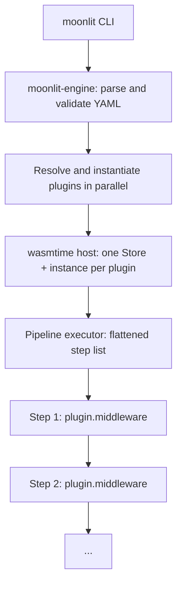

# How Moonlit Works

This page explains the architecture Moonlit uses to turn a YAML pipeline definition into a running release: the `moonlit` CLI, the `moonlit-engine` library it calls into, and the `wasmtime`-based host that runs each plugin as a sandboxed WebAssembly component.

## Architecture Overview

## Core Components

### CLI (`moonlit-cli`)

The `moonlit` binary is a thin UX layer over the engine: it parses command-line arguments, renders progress (spinners, download bars, a live log region per step) and the final execution summary, and maps engine errors to exit codes. It calls into `moonlit-engine` as a library — the CLI itself has no pipeline logic.

### Engine (`moonlit-engine`)

The engine does the real work, in a few cooperating modules:

- **Config parser** — reads the YAML pipeline file into a structured model, validating its shape and cleaning it up (trimming names, dropping null entries).
- **Expression/condition engine** — resolves `$(...)` value substitution and evaluates `condition`/`haltIf` expressions (see [Configuration](./configuration.md)).
- **Plugin resolvers** — one per URL scheme (`oci`, `file`, `http`/`https`) that turn a plugin reference into local component bytes.
- **Pipeline executor** — walks the flattened list of steps, calling into plugins through the WASM host and tracking results.

### WASM host

Plugins are WebAssembly components targeting WASI Preview 2 and the `moonlit:plugin` component-model world. The engine hosts them with `wasmtime`: each plugin gets its own `Store` and component instance, and the host implements the capabilities plugins import — structured logging, reading accumulated configuration, progress reporting, and a permission-gated subprocess API — alongside the standard `wasi:http`, `wasi:filesystem`, and `wasi:cli` interfaces. Because plugins run inside this sandbox rather than as native code, the engine mediates every capability a plugin uses; see [Plugins System](./plugins.md) for how that access is granted.

## Execution Model

Running a pipeline follows the same sequence regardless of what plugins it uses:

1. **Parse** — the CLI reads the YAML file and the engine turns it into a pipeline configuration.
2. **Resolve plugins** — the engine resolves and instantiates every plugin listed in `plugins` **in parallel**: pull from the local content-addressed cache or an OCI registry (or read a `file://`/`http(s)://` reference), then instantiate the component in `wasmtime`.
3. **Flatten stages** — stages are flattened, in declaration order, into a single linear list of steps. Stage names only matter for the `-s`/`--stage` filter (see [Stages and Steps](./stages-steps.md)); they don't create parallel branches or express dependencies beyond ordering.
4. **Execute steps sequentially.** For each step the engine: checks for cancellation, reports progress, evaluates `condition` (skipping the step if it's falsy), merges the step's `config` over the accumulated configuration with `$(...)` substitution, calls the plugin's `execute` export (bounded by `--step-timeout` when one is set), records a `StepResult` (name, success, skipped, duration, error), logs any warnings, stops the pipeline on failure unless `continueOnError` is set, appends the step's outputs under `output:<stepName>:<key>`, and finally evaluates `haltIf` (cleanly stopping the pipeline if it's truthy).
5. **Summarize** — a summary table is rendered and the process exits with a code reflecting the outcome.

Before step 2 begins, the engine also checks every step's `run:` reference against the middlewares each plugin reports, so an unknown plugin alias or middleware name is a load-time configuration error rather than a failure partway through the run.

## Plugin Lifetime and Shared State

Each plugin gets **one component instance for the whole pipeline run**, created during plugin resolution and kept alive until the pipeline ends. This lets a plugin keep state in memory across steps: for example, the `git` plugin's `latest-tag` middleware can store the resolved tag SHA in instance memory, and a later `commits` step on the same plugin reads it back. Instances (and their `Store`) are dropped once the pipeline finishes.

## Error Handling and Exit Codes

The engine's errors map to a small, doc-promised set of process exit codes: `0` success, `1` general/unexpected error, `2` configuration error, `3` plugin load error, `4` pipeline execution error (a step failed).

By default a failing step stops the pipeline; setting `continueOnError: true` on a step lets the pipeline continue past it. Because `wasmtime` permanently poisons a component's `Store` after a trap, a plugin that traps can't safely keep running for the rest of that pipeline run — so the engine also marks the *plugin* itself unavailable after a trap, and any later step that targets it fails fast rather than silently losing that plugin's in-memory state. A step that exceeds `--step-timeout` is treated the same way, and aborts the run outright even when the step sets `continueOnError`, since its interrupted instance can't be reused.

## Next Steps

- Learn about the [Plugins System](./plugins.md)
- Understand [Stages and Steps](./stages-steps.md) in more detail
- Explore the [Configuration](./configuration.md) options
